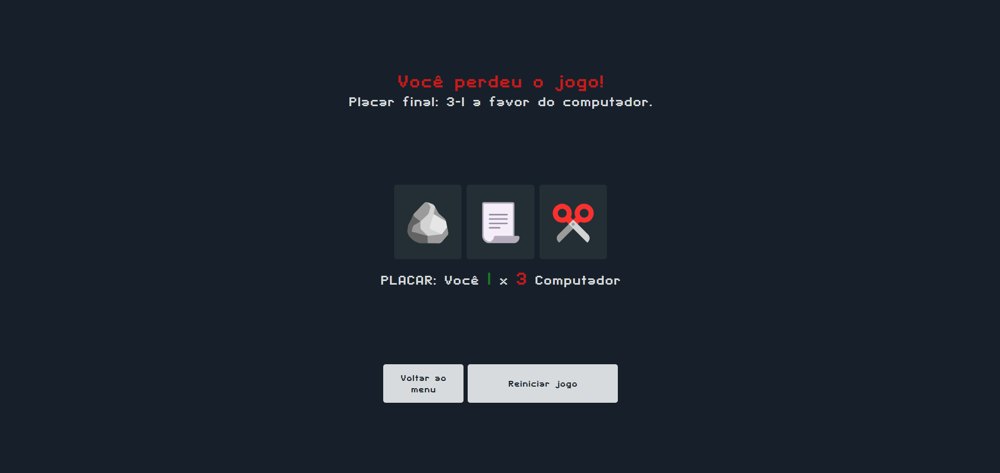

# ✋🪨📄 Jogo: Pedra Papel Tesoura

Projeto de jogo “Pedra, Papel ou Tesoura” simples criado como prática de JavaScript.  
O jogador escolhe uma opção (pedra, papel ou tesoura) e joga contra a máquina.  
Feito para aprender manipulação do DOM, lógica de jogo e tratamento de eventos.

🔗 [Veja o jogo online](https://wagnertomaz.github.io/jogo-pedra-papel-tesoura/)  
 

---

## Sobre o Projeto

- **Tipo de projeto:** Jogo de browser  
- **Objetivo:** Implementar a lógica do jogo Pedra-Papel-Tesoura (versus computador)  
- **Funcionalidades principais:**  
  - Jogar contra o computador  
  - Mostrar quem venceu cada rodada  
  - Reiniciar o jogo  

---

## Tecnologias Utilizadas

- HTML5  
- CSS3  
- JavaScript  
  - DOM para capturar cliques do jogador  
  - Lógica de comparação para determinar vencedor  

---

## 👨‍💻 Autor

- [Wagner Tomaz](https://github.com/wagnertomaz)
